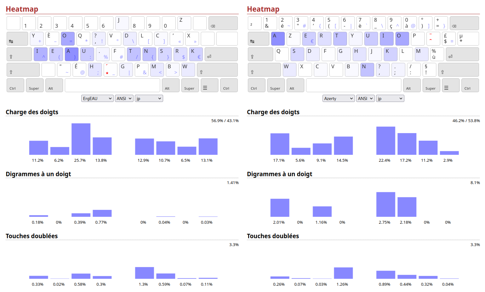

## Motivations

Le japonais est la 3e langue que j'utilise le plus, j'ai donc créé un corpus pour comparer ce layout à Azerty et ErgoLv5 que j'utilisais précédemment.

## Création du corpus

J'ai choisi comme œuvre pour le corpus le light novel 三日間の幸福 (Mikkakan no Koufuku/Three days of Happiness). C'est le LN le mieux noté sur [Anilist](anilist.co), et il n'y a que 3 personnages (qui parlent de manière assez naturelle) donc j'ai pu facilement enlevé les noms propres du corpus.

J'ai utilisé le site [Nihongodera](https://nihongodera.com/tools/romaji-converter) pour convertir le texte en rōmaji, mais j'ai dû faire quelques modifications pour que ça corresponde à comment je tape en japonais :
- tous les allongements étaient faits avec un accent macron plutôt que ou/uu/aa/ee
- les particules wo et he étaient notées o et e
- nn -> nnn dans les mots comme "sonna"
- n' -> nn dans les mots comme "kin'en"
- autres modifications mineures comme CD noté shi-dhi- au lieu de shi-ji-

## Résultats

C'est loin d'être parfait mais c'est tout de même mieux qu'Azerty sur tous les aspects (grâce à la répartition voyelles-consonnes).

Niveau heatmap il n'y a rien à dire c'est beaucoup mieux.

La charge des doigts est asseez mauvaise avec le 25.5% sur le majeur gauche à cause de oa/ao à 25.5% et des verbes en -u (avec , et .), mais en échange le SFB est 5.7 fois meilleur. D'ailleurs c'est le SFB le plus bas en parmi les layouts anglais-français ! En plus les achoppements sont concentrés sur le majeur et l'index, ce qui est une bonne chose.

Les douches doublées sont un peu mieux réparties mais on en a plus sur les auriculaires...

Niveau roulements Azerty est bien meilleur :
Azerty : 18.7% / 24.8%
ErgEAU : 8.1% / 9.8

Mais en échange on a beaucoup moins de redirections (même très peu) :
Azerty : 14.9%
ErgEAU : 3.2% 

ErgoL-v5 était mieux que ErgEAU sur à peu près tout hormis le taux de redirection invivable (18.4%), un SFB légèrement supérieur et un auriculaire gauche qui souffrent énormément. Quant à ErgoLv6, il est assez mauvais (3.4% de SFB et grosses redirections), hormis la répartition où tous les doigts sont presque égaux.