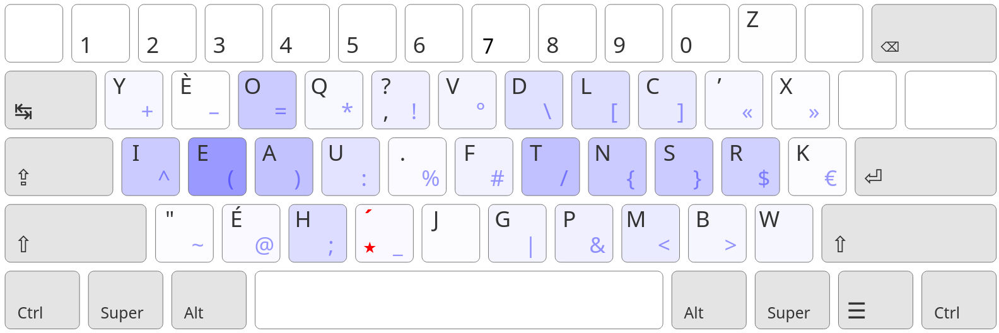
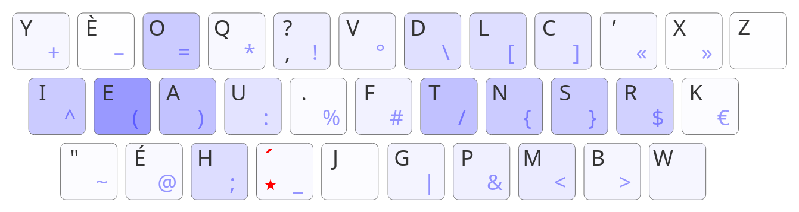
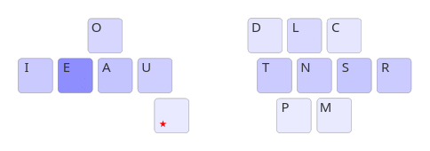
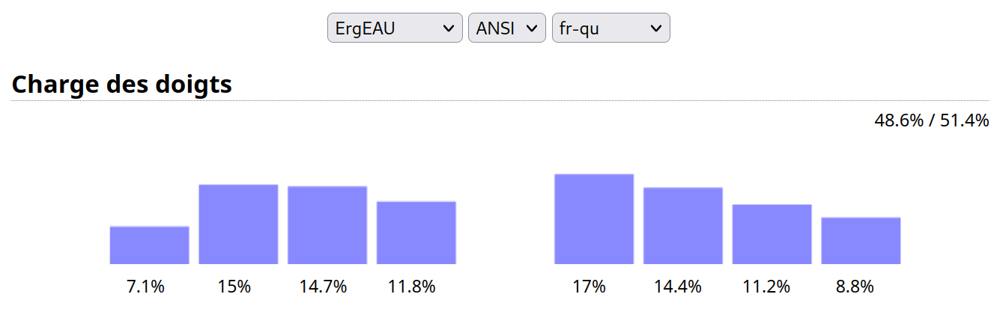
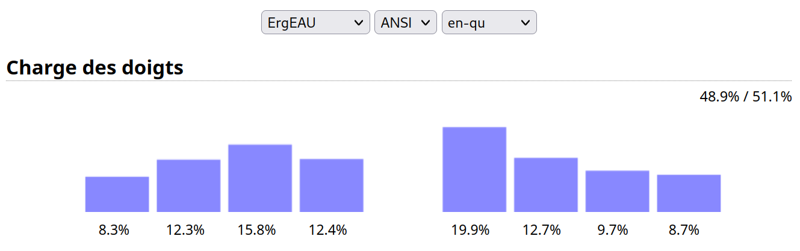
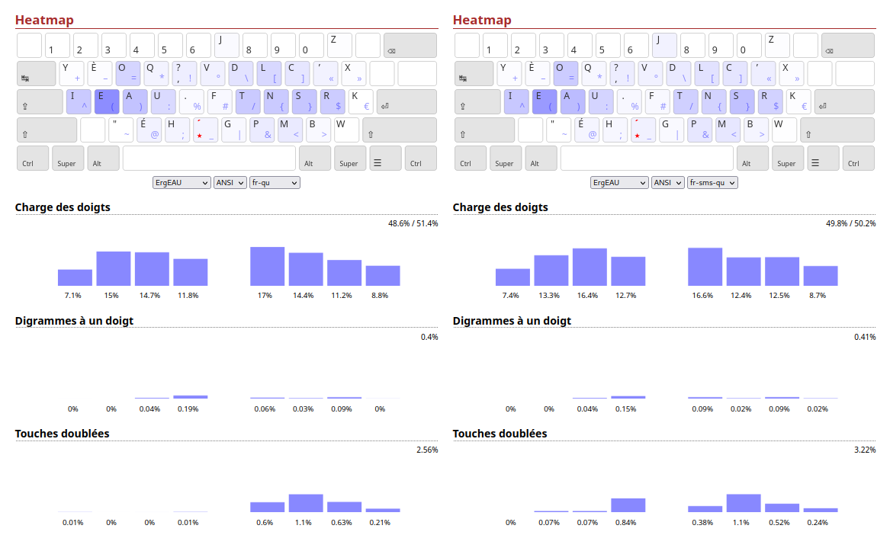

# ErgEAU

## Introduction

ErgEAU est une disposition de clavier qui se veut optimale pour le français et l'anglais. Elle est conçue pour les claviers ISO/ANSI/JIS (tous les claviers standard), mais fonctionne aussi sur les claviers orthogonaux à condition d'avoir deux touches à droite de l'auriculaire droit. ErgEAU est également assez bon (bien meilleur qu'Azerty en tout cas) en [espagnol](./images/Espagnol.png), en [japonais](./Japonais.md) et dans la plupart des langues latines étant donnée la proximité avec le français.

## Spécificités d'ErgEAU

### Angle Mod

Introduit par la communauté de [Colemak](https://colemakmods.github.io/ergonomic-mods/angle.html), "Angle Mod" correspond au fait de gérer la main gauche de manière symétrique avec la main droite. Cette position est plus confortable, et permet de mettre une touche en plus sur l'index en en enlevant une au petit doigt, ce qui est mieux pour la charge des doigts.

La seule différence en ErgEAU est qu'il est légèrement plus optimisé de cliquer sur Z avec l'index droit.

### Lettre morte

En Azerty la touche ^ est une lettre morte : en cliquant dessus on peut obtenir la version accentuée de la prochaine lettre cliquée. Néanmoins, on peut généraliser ce concept en incluant toutes les variantes des lettres introduites par le français (à, ç, ù, œ, etc.), ce qui libère de la place pour des meilleures arrangements des lettres les plus fréquentes.

De plus en ErgEAU  on place également l'apostrophe sous la lettre morte, sur la barre espace comme en ErgoL. Il en va de même pour le tiret.

### Remap du Q en Qu

Beaucoup moins standard, le remplacement de la touche Q par Qu permet d'utiliser ErgEAU à son plein potentiel. En effet, en français comme en anglais, l'écrasante majorité des Q sont suivis par un U (les exceptions courantes étant "cinq" et "piqûre"), on peut donc simplement mettre le Q isolé sous Qu via la lettre morte pour les rares cas où cela est nécesaire.

Ce choix a été fait car il permet de placer Q sur l'index avec U, augmentant la charge de ce dernier et permettant tous les roulements que/qui/qua/quo/qué très facilement sur la main gauche.

Pour ceux qui ne voudraient pas faire cela, il est possible d'inverser Q avec J, W, Z, X ou K, mais cela fait baisser les statistiques en plus de faire perdre tous les roulements avec "qu".

## Comparaison aux alternatives français-anglais

### Digrammes à un doigt (SKB) 

Dans les dispositions connues, ErgEAU est le seul à avoir un taux total d'enchaînement de lettres sur le même doigt inférieur à 1% dans les deux langues, et le seul à en avoir un inférieur à 0.5% en français.

Il est plus de presque 10 fois meilleur qu'Azerty et Lafayette sur cet aspect.

| Layout    | FR    | EN    | FR-EN |
|-----------|-------|-------|-------|
| ErgEAU    | 0.44% | 0.90% | 0.69% |
| Optim7    | 0.70% | 1.38% | 1.06% |
| Optimot   | 0.84% | 1.57% | 1.22% |
| ErgoL     | 1.36% | 1.39% | 1.37% |
| Bépo      | 2.55% | 3.02% | 2.80% |
| Lafayette | 6.83% | 5.96% | 6.32% |
| Azerty    | 7.19% | 6.29% | 6.72% |

### Redirections

Certains trigrammes (enchaînements de 3 lettres) se font dans on ordre qui fait revenir en arrière le "flot" des doigts ("oui" en Azerty par exemple), au lieu de faire un roulement qui est beaucoup rapide et satisfaisant ("ser" en Azerty). C'est ce qu'on appelle les redirections.

ErgEAU cherche à minimiser le plus possible ces redirections, et y arrive également mieux que ses concurrents. 

| Layout    | FR    | EN    | FR-EN |
|-----------|-------|-------|-------|
| ErgEAU    | 2.4%  | 2.2%  | 2.3%  |
| Optim7    | 2.2%  | 2.6%  | 2.4%  |
| Optimot   | 2.6%  | 3.4%  | 3.0%  |
| Bépo      | 3.4%  | 3.1%  | 3.2%  |
| Azerty    | 9.2%  | 11.1% | 10.2% |
| ErgoL     | 9.0%  | 11.4% | 10.3% |
| Lafayette | 8.2%  | 12.5% | 10.4% |

### Redirections hors index (Bad Redirects)

Parmi les redirections, certaines sont bien plus problématiques : ce sont celles qui se font sur les trois doigts les moins forts (majeur, annulaire et auriculaire). En Azerty par exemple "sea" est assez dur à écrire. C'est d'ailleurs là que réside un des plus grands défauts d'ErgoL.

ErgEAU est très bon sur ce point également, seul Optimot fait mieux mais de manière assez inéquitable entre les deux langues. Les seuls bons concurrents :

| Layout    | FR     | EN     | FR-EN  |
|-----------|--------|--------|--------|
| Optimot   | 0.105% | 0.405% | 0.255% |
| ErgEAU    | 0.299% | 0.269% | 0.284% |
| Bépo      | 0.557% | 0.372% | 0.465% |
| Optim7    | 0.254% | 0.727% | 0.491% |
| Azerty    | 1.026% | 1.014% | 1.020% |
| Lafayette | 1.026% | 1.033% | 1.030% |
| ErgoL     | 2.261% | 1.969% | 2.115% |

PS : Ces statistiques sont à prendre avec des pincettes car ils ont été réalisés avec [oxey](https://o-x-e-y.github.io/layouts/playground/index.html), qui ne permet pas de mettre toutes les lettres comme prévues (en plus d'être fait pour les claviers ortho). Q, W, K et Z sont omises en français, et Q, J, X et Z en anglais.

Encore pire, les bad redirects qui ont un roulement extérieur sur l'annulaire et l'auriculaire ("sad" en Azerty, ou "rui" en ErgoLv5). ErgEAU en comporte très très peu : "eye" (0.011%) et "eyo" (0.002%)

### Roulements de digrammes (Rolls)

Malgré les débats vis-à-vis de ce qui est le plus efficace en termes de rapidité entre les roulements et la separations des lettres qui se suivent, ErgEAU offre une quantité de roulements presque équivalente à celle Optimot et supérieure à celles d'Optim7 et Bépo.

ErgEAU a été conçu avec peu de considération pour les roulements comparé aux statistiques précédentes, en prenant le parti que la séparation des lettres est meilleure ou équivalente, en plus du fait qu'elle est à l'origine de la réduction drastiques de redirections vis-à-vis des dispositions sans séparation comme ErgoL. C'est pourquoi elle a beaucoup moins de roulements qu'ErgoL, Azerty et Lafayette.

De plus, les roulements vers l'intérieur du clavier sont généralement considéré comme meilleurs. Dans le tableau suivant on a les taux de roulements intérieur et extérieur :

| Layout    | FR          | EN          | FR-EN       | Total |
|-----------|-------------|-------------|-------------|-------|
| ErgoL     | 22.9% 18.0% | 23.7% 17.4% | 23.3% 17.7% | 41.0% |
| Lafayette | 18.1% 19.0% | 18.5% 18.2% | 18.3% 18.6% | 36.9% |
| Azerty    | 18.8% 18.6% | 18.4% 17.2% | 18.6% 17.9% | 36.5% |
| Optimot   | 15.7% 10.5% | 14.1% 13.8% | 14.8% 12.2% | 27.0% |
| ErgEAU    | 13.1% 12.8% | 12.6% 13.0% | 12.8% 12.9% | 25.7% |
| Bépo      | 15.3% 9.1%  | 13.9% 12.0% | 14.6% 10.6% | 25.2% |
| Optim7    | 13.4% 10.7% | 16.0% 9.7%  | 14.7% 10.2% | 24.9% |

### Répartition des touches (heatmap) 

La heatmap d'ErgEAU est meilleure que celles d'Optimot et Optim7 et à peu près équivalente à celle d'ErgoL (en plus d'avoir É et É directement accessibles) :

Un grand avantage supplémentaire de cette disposition est la monopolisation des touches des petits doigts et annulaires. En effet, les 15 lettres plus fréquentes en français et anglais sont disposées de cette manière : 

Oieaieauaein voit que I, E et R monopolisent leur doigt, ce qui minimise les déplacements latéraux sur ces trois doigts qui sont plus faibles que les majeurs et index. L'index droit a trois lettres principales mais dans les deux cas elles font partie des 4 les plus accessibles (grâce au décalage de la ligne du bas en anglais dû au clavier staggered).

ErgEAU a été conçu en suivant lorsque possible les poids de chaque touche en Angle Mod, calculés [ici](https://colemakmods.github.io/mod-dh/model.html) :

L'ordre de placement des lettres suit relativement bien l'ordre décroissant des fréquences mais évidemment s'en éloigne pour permettre des statistiques aussi bons.

|     |   | FR | EN | 50 |
|-----|---|----|----|----|
| 1.0 | T | 6  | 2  | 2  |
| 1.0 | U | 8  | 12 | 9  |
| 1.1 | A | 3  | 3  | 3  |
| 1.1 | N | 4  | 6  | 4  |
| 1.3 | E | 1  | 1  | 1  |
| 1.3 | S | 2  | 8  | 5  |
| 1.6 | I | 5  | 7  | 7  |
| 1.6 | R | 7  | 9  | 8  |
| 1.8 | H | 20 | 5  | 11 |
| 1.8 | P | 15 | 21 | 16 |
| 2.0 | L | 10 | 11 | 10 |
| 2.1 | O | 9  | 4  | 6  |
| 2.2 | D | 11 | 10 | 12 |
| 2.2 | G | 22 | 18 | 19 |
| 2.2 | Q | 19 | 27 | 24 |
| 2.3 | * | 13 | 20 | 18 |
| 2.4 | C | 12 | 15 | 13 |
| 2.4 | M | 14 | 13 | 14 |
| 2.4 | É | 18 | 30 | 25 |
| 2.5 | È | 27 | 31 | 30 |
| 2.6 | , | 16 | 17 | 15 |
| 2.9 | F | 21 | 14 | 17 |
| 2.7 | B | 23 | 22 | 22 |
| 2.9 | . | 25 | 25 | 26 |
| 3.0 | Y | 28 | 19 | 23 |
| 3.0 | [J*](https://github.com/IgrecL/ergeau#corpus-sms)| 24 | 28 | 28 |
| 3.4 | W | 30 | 16 | 21 |
| 3.4 | V | 17 | 23 | 20 |
| 3.6 | K | 31 | 24 | 27 |
| 3.6 | X | 26 | 26 | 29 |

Comme expliqué [ici](https://github.com/IgrecL/ergeau#corpus-sms), le corpus ErgoL sous-estime J en français, il est donc pertinent de la considérer d'après les statistiques SMS comme étant au rang 23.5, ce qui justifie sa position au-dessus de W et K.

### Charges des doigts 

Grâce au placement de O sur A (par opposition à la plupart des layouts français qui placent O sur E), aucun doigt n'a une charge supérieur à 20% dans les deux langues. Dans les layouts cités précédemment, seul ErgoL peut dire de même.

En français, l'annulaire gauche est assez chargé puisqu'il gère E, mais étant donné qu'il monopolise la colonne comme dit plus tôt (contrairement aux deux autres doigts), cela est moins un problème qu'il n'y paraît. De plus, cela est nuancé [ici](https://github.com/IgrecL/ergeau#corpus-sms).

Le ratio des deux mains est presque à 50/50 en français et très bon en anglais. C'était notamment un défaut de l'Optimot (EN 46.3% / 53.7%) et Bépo (EN 45.5% / 54.5%) et un gros problème de l'Optim7 (EN 43.6% / 56.4%). ErgoL quant à lui s'en sortait assez mal en français avec 54.8% / 45.2%.

### Digrammes à une touche (SKB)

Le majeur et l'index sont forts pour appuyer deux fois sur la même touche, mais c'est moins le cas de l'annulaire et encore moins de l'auriculaire. C'est pourquoi ErgEAU évite les SKB sur les petits doigts.

Étant donné la séparation voyelles/consonnes, la main droite a la majorité des SKB, mais c'est compensé par le fait que c'est la main avec le moins de charge en français (voir après).

En ErgEAU la seule lettre doublée sur les auriculaires est R (et I dans les verbes au subjonctif de la 1ère personne du pluriel comme "criions", mais c'est très rare).

Pour comparer aux autres dispositions, on calcule la somme des SKB sur les auriculaires :

| Layout    | FR    | EN    | FR-EN |
|-----------|-------|-------|-------|
| ErgoL     | 0.09% | 0.10% | 0.10% |
| Lafayette | 0.12% | 0.11% | 0.12% |
| ErgEAU    | 0.22% | 0.15% | 0.19% |
| Optimot   | 0.28% | 0.18% | 0.23% |
| Azerty    | 0.37% | 0.14% | 0.26% |
| Optim7    | 0.30% | 0.24% | 0.27% |
| Bépo      | 0.63% | 0.32% | 0.48% |

### Single finger skipgrams (SKS/DSFB)

Étant donné qu'on a plus ou moins séparé les consonnes, les SFB ont chuté en flèche. Cependant, on peut aller plus loin : lorsqu'on écrit le mot "for" sur un clavier Azerty/Qwerty, étant donné que F et au-dessus de R, "f*r" agit comme un SFB sur la main gauche. C'est une métrique plus dur à optimiser mais tout de même très importante.

Heureusement, cette fois aussi ErgEAU est meilleur que ses concurrents, presque sous la barre des 7%. À noter néanmoins que ce n'est pas la disposition optimale pour les SKS en particulier (il est possible de faire moins de 7%), mais les autres métriques semblent plus importantes.

| Layout    | FR     | EN     | FR-EN  |
|-----------|--------|--------|--------|
| ErgEAU    | 6.615% | 7.389% | 7.002% |
| Optim7    | 6.959% | 7.685% | 7.322% |
| Bépo      | 7.285% | 7.578% | 7.432% |
| ErgoL     | 6.824% | 8.265% | 7.545% |
| Optimot   | 7.096% | 8.852% | 7.974% |
| Azerty    | 8.490% | 10.77% | 9.631% |
| Lafayette | 8.490% | 10.62% | 9.555% |

PS : Tout comme pour les Bad Redirects, c'est statistiques ont été fait via oxey ; ils sont donc à prendre à la légère. 

### Déplacements latéraux (LSB)

Un autre problème implicite : les lettres du bloc central, entre les deux index, nécessitent des déplacement latéraux qui viennent déranger les autres doigts et engendrent donc un baisse de rapidité pour les enchaînements.

Bépo misait sur cet aspect au détriment du reste, c'est pourquoi c'est le seul à battre ErgEAU sur cet aspect (mais ce dernier a tout de même un LSB bien inférieur reste). 

| Layout    | FR     | EN     | FR-EN  |
|-----------|--------|--------|--------|
| Bépo      | 0.685% | 0.637% | 0.661% |
| ErgEAU    | 1.101% | 0.960% | 1.031% |
| Optim7    | 1.193% | 1.721% | 1.457% |
| ErgoL     | 1.366% | 3.075% | 2.221% |
| Optimot   | 2.039% | 3.327% | 2.683% |
| Azerty    | 4.496% | 6.730% | 5.613% |
| Lafayette | 4.496% | 6.882% | 5.689% |

PS : Les LSB ont été calculé pour une disposition ortho, donc les résultats peuvent être assez différents en ANSI/ISO/JIS (sûrement meilleurs pour ErgEAU), mais le tendance globale reste la même.

### Comparaison globale

| Layout        | ErgEAU | Optim7   | Optimot | ErgoL | Bépo | Lafayette | Azerty |
|---------------|--------|----------|---------|-------|------|-----------|--------|
| SFB           | **1**  | 2        | 3       | 4     | 5    | 6         | 7      |
| Redirects     | **1**  | 2        | 3       | 6     | 4    | 7         | 5      |
| Bad Redirects | 2      | 4        | **1**   | 7     | 3    | 6         | 5      |
| Rolls         | 5      | 7        | 4       | **1** | 6    | 2         | 3      |
| Charges       | **1**  | 4        | 3       | 2     | 7    | 5         | 6      |
| SKB           | 3      | 6        | 4       | **1** | 7    | 2         | 5      |
| DFSB/SKS      | **1**  | 2        | 5       | 4     | 3    | 7         | 6      |
| LSB           | 2      | 3        | 5       | 4     | **1**| 7         | 6      |

## Corpus SMS

Le corpus d'ErgoL étant basé sur un livre, la fréquence des mots et conjugaisons relatives à la 1ère et 2e personne en français est bien plus faible qu'elle ne devrait l'être étant donnée notre utilisation des messageries et réseaux sociaux. J'ai donc récupéré un corpus de 1000 SMS corrigée en bon français depuis [ce site](http://88milsms.huma-num.fr/data4science/corpusdisponible.html), et en recorrigeant par dessus on obtient un corpus assez fiable un français écrit dans les messages (bien que pas assez rempli).

On remarque également que J est BEAUCOUP plus important que dans le corpus d'ErgoL, ce qui explique pourquoi je le mette au-dessus de R.

Le ratio de charge des deux mains est moins bon mais en échange le E est moins utilisé donc ça corrige le problème de la charge individuelle des doigts de la main gauche.

Le SFB reste le même, mais le SKB augmente énormément sur l'index gauche avec les digrammes .. ?? !! ?! (ce qui n'est pas une mauvaise chose vu que c'est un doigt fort).

## Autres aspects intéressants d'ErgEAU

- ErgEAU est globalement potable dans les autres langues étant donnée la séparation voyelles-consonnes qui empêche SFB consonne/voyelle et les redirections
- le SKB est minime sur tous les doigts sauf l'index gauche en français (< 0.1%), et en anglais ils sont concentrés sur les deux index
- le placement de U est optimal car c'est la voyelle qui intéragit le moins avec , et .
- I étant aussi à son emplacement optimal pour la charge de l'auriculaire, seuls IEAU et IAEU semblent fiables, mais IEAU offre de meilleures statistiques de redirections et roulements en ANSI

## Idées rejetées :

- mettre À sous E augmente la charge de l'annulaire en plus de donner une mauvaise position à E, et puisque rien ne va avec E il vaut mieux mettre un symbole rare tel que "
- il est possible de mettre Z sur la touche au-dessus de X pour libérer une place pour ', mais cela rend les enchaînements moins pratique qu'avec la lettre morte
- IEAU TNSR semble optimal pour les redictions et les roulements je n'ai pas réussi à faire mieux en ANSI
- l'inversion W <-> J semble bonne car c'est une lettre plus importante dans le corpus d'Ergol, mais c'est expliqué [ici](https://github.com/IgrecL/ergeau#corpus-sms) pourquoi J est plus important que W
- l'inversions Z <-> J fait gagner 0.01% de SFB en français mais est moins bonne pour la répartition
- l'inversion , <-> . car même si le . sert plus en programmation, la touche , a également ? et ! donc elle est plus importante
- l'inversion Q <-> , semble plus logique niveau importance des lettres mais étant donnés tous les roulements avec Qu c'est mieux ici (et ça réduit les LSB vu que Q n'est plus vraiment dans le bloc central grâce au décalage de la ligne du bas)
- l'inversion D <-> P est de prime abord meilleure vis-à-vis de l'importance des touches, mais ce placement permet d'avoir "mp" et "ld" plus facilement et on ne perd pas la facilité de frappe de "pl" grâce au fait que ANSI est staggered
- l'inversion B <-> G permet un bien meilleur lsb mais la position de G est très mauvaise en plus de rendre ng/ng/gr/rg assez durs à faire, et on perdrait le digramme mb en roulement
- l'inversion V <-> F est meilleure pour le français vis-à-vis de la fréquence des lettres, mais il est mieux de prioriser F pour le digramme "ff", et V ici ne produit pas un gros lsb étant donné que les deux plus gros digrammes vr/rv sont avec R sous l'auriculaire, lequel ne bouge pas avec le déplacement latéral de l'index
